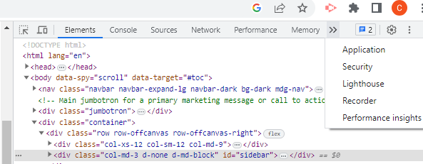

# DAILY WORK PLANNER

## Description
This is a daily 9am to 5pm work planner which allows the user to add reminders such as events, or meetings. These can be added in for each hour of the work day. It is connected to the Day.js API to update each hour time block as either **Present**, which is red, **Past**, which is grey, and **Future**, which is green. Local storage is utilised to ensure that any reminders added persist on page reload.

### Features
This application features:
- jQuery library
- DOM manipulation
- Local storage
- JSON stringify & parse methods

---

## Visuals
This is a preview of the expected functionality of the application.

---

## Installation
N/A

---

## Usage
The deployed application is available at [Application link](https://christinelea.github.io/Daily-Work_planner/)
To view local storage in the browser, right-click and select **Inspect**. This will open the Developer Tools. Select the >> icon, then select **Application**. This will display local storage. This can be seen in the below image.

---

## Support
For any support, please submit a **GitHub Issue**.

---

## Roadmap
Future considerations include allowing users to change the daily work hours to suit their daily work roster. 

---

## Contributing
Not currently taking any contribution for this project.

---

## Authors and acknowledgment
This application was completed by myself. I was provided HTML and CSS starter code through my Monash University Full Stack Flex Bootcamp.

---

## License
MIT License

## Project status
Currently project status is complete.